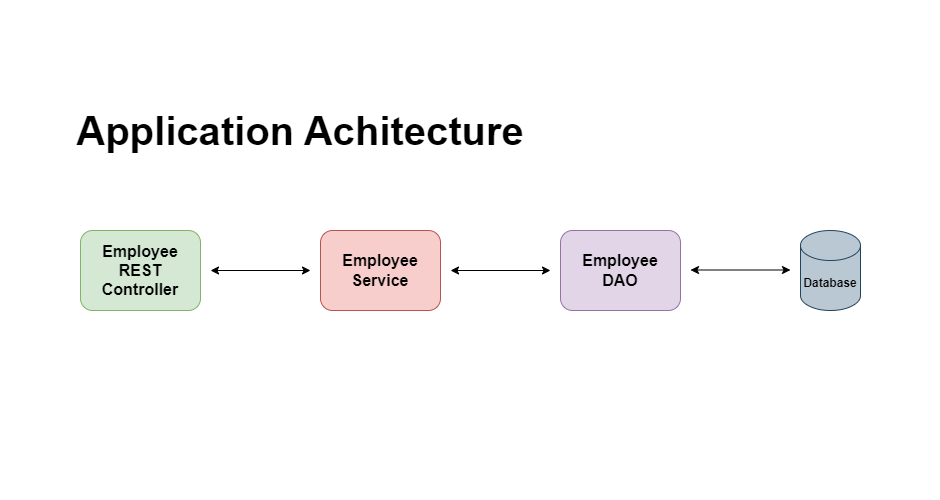

# Java Spring application to manage employee data

## Application Architecture

**Endpoints exposed**

GET &emsp; &nbsp; - /api/employees \
GET &emsp; &nbsp; - /api/employees/{employeeId} \
POST &emsp; - /api/employees \
PUT &nbsp; &nbsp; &nbsp; &nbsp;- /api/employees \
DELETE &nbsp; - /api/employees/{employeeId}
